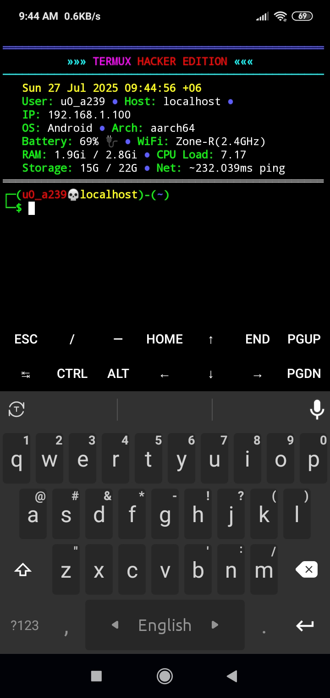

# THE (Termux Hacker Edition)

Welcome to **THE (Termux Hacker Edition)** — a sleek info panel for Termux showing battery, WiFi, storage, RAM, CPU load, network speed, and more, with a hacker-style prompt!

---

## Features

- Real-time battery status with icons
- WiFi SSID and IP display
- Storage and RAM usage stats
- CPU load average
- Network ping speed
- Custom colorful shell prompt with battery-based colors
- Background auto-update script to keep info panel fresh

---
##ScreenShot:
 

---

## 📦 Installation Guide (Step-by-step)

This guide assumes you are installing on a fresh Termux setup on an Android device. No prior knowledge needed!

### 1. Install Termux

- Download and install Termux from [F-Droid](https://f-droid.org/en/packages/com.termux/) (recommended) or Google Play Store.

### 2. Open Termux and Update Packages

Run the following commands to update Termux packages:

```bash
pkg update -y && pkg upgrade -y
````

### 3. Install Required Packages

```bash
pkg install -y termux-api jq inetutils coreutils bash curl
```

* **termux-api** : Allows access to battery and wifi info.
* **jq** : JSON processor.
* **inetutils** : Includes ping command.
* **coreutils, bash** : Core Linux utilities and shell.
* **curl** : To download update script.

### 📲 3.1 Install Termux:API App (Important!)

To allow Termux to access system features like battery, WiFi, storage, etc., install the **Termux:API app** from F-Droid:

👉 [https://f-droid.org/en/packages/com.termux.api/](https://f-droid.org/en/packages/com.termux.api/)

Or Direct download from this link quickly  [https://f-droid.org/repo/com.termux.api_1000.apk](https://f-droid.org/repo/com.termux.api_1000.apk)

This is required for all `termux-*` commands to work properly.


### 4. Setup Storage Permission

Run this command to allow Termux access to device storage:

```bash
termux-setup-storage
```

You will be prompted to allow permission; accept it.

### 5. Grant Location Permission (Needed for WiFi SSID)

* Go to your device’s **Settings → Apps → Termux → Permissions**.
* Enable **Location** permission to allow WiFi SSID reading.

---

### 6. Clone or Download THE Repository

You can clone your GitHub repo:

```bash
git clone https://github.com/bayazid-bit/THE.git
cd THE
```

Or manually download the scripts and put them in a directory.

---

### 7. Run the Installer Script

From inside the `THE` directory, run:

```bash
bash install.sh
```

This will:

* Copy `.banner.sh` and `.update.sh` to your home directory.
* Add commands in your `~/.bashrc` to automatically start the info panel and the background update script.
* Notify you to restart Termux.

---

### 8. Restart Termux

Close Termux and open it again. You should see the fancy info panel and colored prompt on startup!

---

## 🔄 How to Update THE

The tool runs an update script silently in the background on each new Termux session.

If you want to manually update THE scripts, run:

```bash
bash ~/.update.sh
```

This will fetch the latest `.banner.sh` from your GitHub repo.

---

## 🧹 How to Uninstall THE

If you want to remove THE and revert your Termux environment:

1. Run the uninstall script:

```bash
bash uninstall.sh
```

2. This will:

* Remove the autostart entries from your `~/.bashrc`.
* Delete the `.banner.sh` and `.update.sh` scripts from your home directory.
* Inform you to restart Termux.

3. Restart Termux to confirm removal.

---

## Troubleshooting

* **WiFi SSID shows "null" or "Disconnected"?**
  Make sure Location permission is granted to Termux (see Step 5).

* **Battery or WiFi info not showing correctly?**
  Ensure `termux-api` is installed and permissions are granted.

* **Update script not working?**
  Check your internet connection or run `bash ~/.update.sh` manually to see errors.

* **Prompt colors or info panel missing?**
  Confirm that `.banner.sh` is sourced in your `~/.bashrc` by this line:

  ```bash
  bash ~/.banner.sh
  ```

---

## About THE

**THE** is designed to provide you a hacker-like terminal experience with real-time system info, tailored for Termux on Android.

---

## Contributions & Issues

Feel free to open issues or contribute to the repo to improve THE.

---

## License

MIT License © 2025 Bayazid

---

## Contact

GitHub: [bayazid-bit](https://github.com/bayazid-bit)

---

**Enjoy hacking your Termux! 😎**


